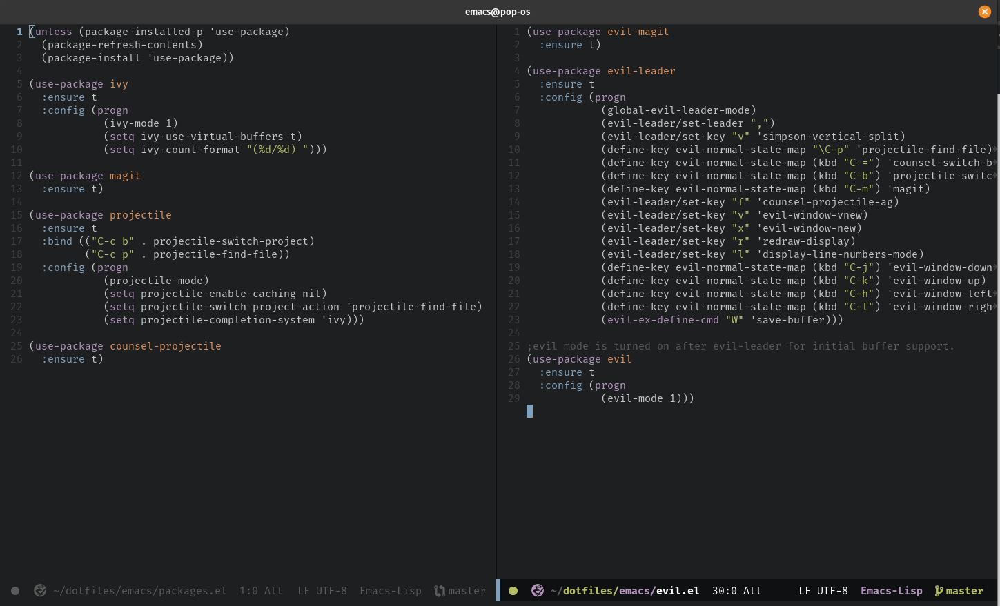

## Patrick's Emacs Config, 2020

Lightweight, fast, and looks sick...

### Packages

#### IDE
 
 - [magit](https://github.com/magit/magit)
 - [evil](https://github.com/emacs-evil/evil)
   - [evil-leader](https://github.com/cofi/evil-leader)
   - [evil-magit](https://github.com/emacs-evil/evil-magit)
 - [ivy](https://github.com/abo-abo/swiper)
 - [projectile](https://github.com/bbatsov/projectile)
   - [counsel-projectile](https://github.com/ericdanan/counsel-projectile)
   - [projectile-rails](https://github.com/asok/projectile-rails)
 - [flycheck](https://github.com/flycheck/flycheck)
 - [tide](https://github.com/ananthakumaran/tide)
 - [company](https://github.com/company-mode/company-mode)
 - [hyrda](https://github.com/abo-abo/hydra)

#### Theme

 - [doom-themes](https://github.com/hlissner/emacs-doom-themes)
   - [doom-tomorrow-night](https://github.com/hlissner/emacs-doom-themes/blob/master/themes/doom-tomorrow-night-theme.el)
 - [doom-modeline](https://github.com/seagle0128/doom-modeline)
 - [all-the-icons](https://github.com/domtronn/all-the-icons.el)

#### Language Support
 - Markdown 
   - [markdown](https://github.com/jrblevin/markdown-mode)
 - HTML/CSS
   - [web-mode](https://github.com/fxbois/web-mode)
 - JavaScript
   - [js2](https://github.com/mooz/js2-mode)
   - [json](https://github.com/joshwnj/json-mode)
   - [js2refactor](https://github.com/magnars/js2-refactor.el)
   - [xref-js2](https://github.com/NicolasPetton/xref-js2)
 - Ruby
   - [inf-ruby](https://github.com/nonsequitur/inf-ruby/)
   - [robe-mode](https://github.com/dgutov/robe)
   - [rspec-mode](https://github.com/pezra/rspec-mode)
   - [rubocopfmt](https://github.com/jimeh/rubocopfmt.el)
